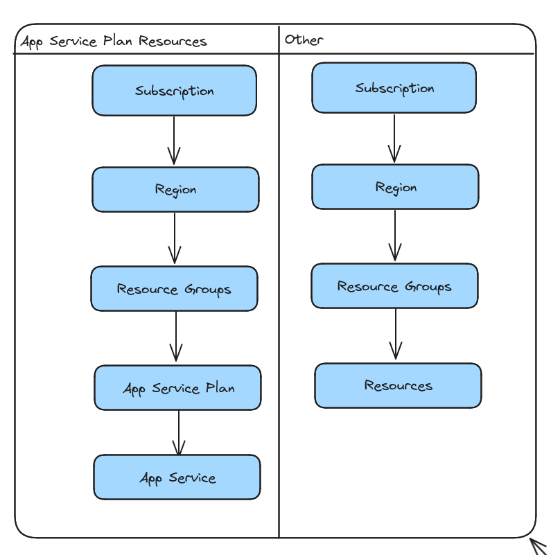
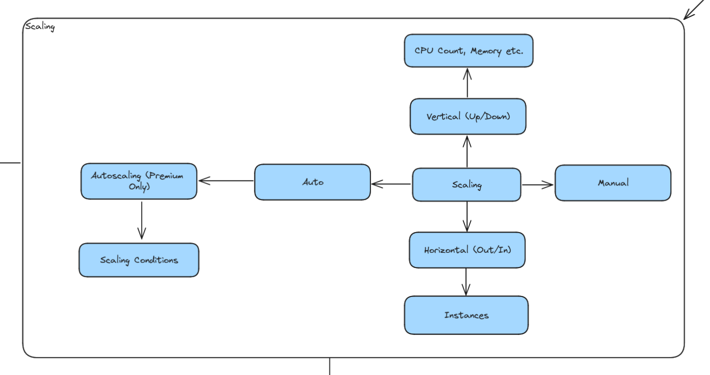
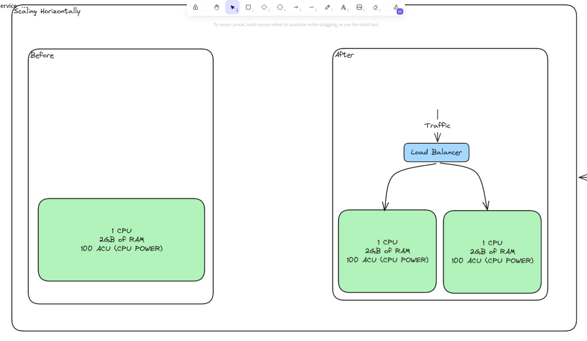
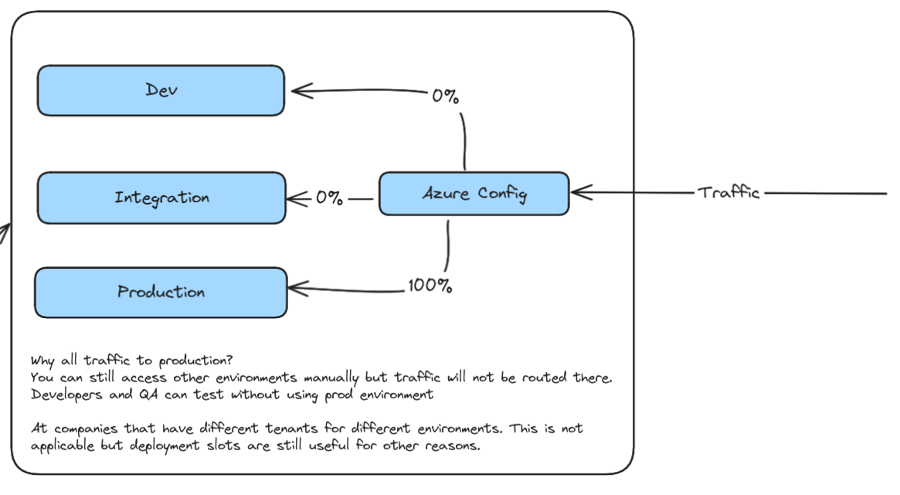
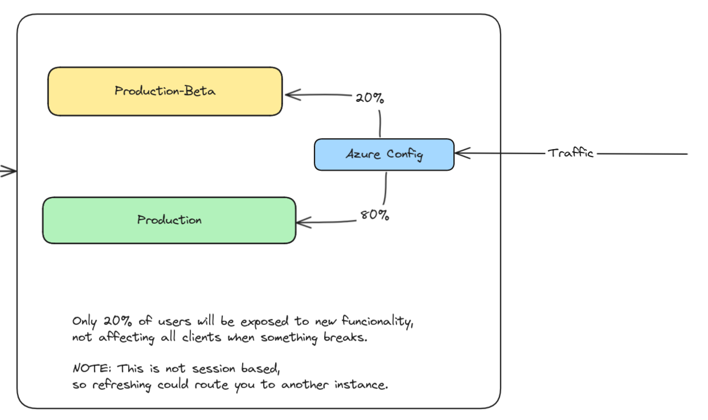
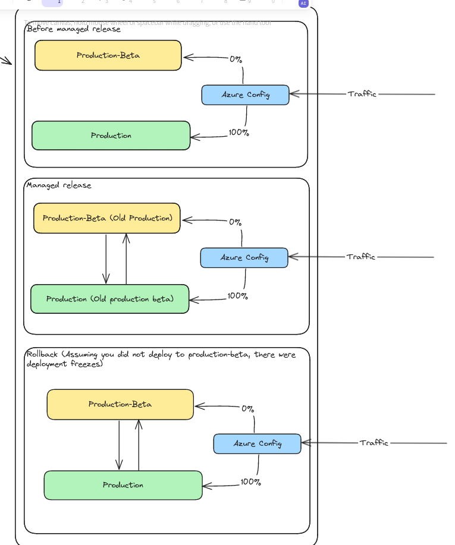

[Issue](https://github.com/Evanlab02/AZ204-Training/issues/1)
# Overview

Azure App Service is an HTTP-based service for hosting web applications, REST APIs, and mobile back ends. You can develop in your favorite programming language or framework. Applications run and scale with ease on both Windows and Linux-based environments.

## Benefits

- Built-in auto scale support
- Continuous integration/deployment support
- Deployment slots
- Does support Linux

## Limitations

- App Service on Linux isn't supported on Shared pricing tier.
- The Azure portal shows only features that currently work for Linux apps. As features are enabled, they're activated on the portal.
- When deployed to built-in images, your code and content are allocated a storage volume for web content, backed by Azure Storage. The disk latency of this volume is higher and more variable than the latency of the container filesystem. Apps that require heavy read-only access to content files may benefit from the custom container option, which places files in the container filesystem instead of on the content volume.
## App Service plans

In App Service, an app always runs in an _App Service plan_. An App Service plan defines a set of compute resources for a web app to run. **One or more apps can be configured to run on the same computing resources (or in the same App Service plan).**

Each App Service plan defines:

- Operating System (Windows, Linux)
- Region (West US, East US, etc.)
- Number of VM instances
- Size of VM instances (Small, Medium, Large)
- Pricing tier (Free, Shared, Basic, Standard, Premium, PremiumV2, PremiumV3, Isolated, IsolatedV2)



### Pricing tiers

The _pricing tier_ of an App Service plan determines what App Service features you get and how much you pay for the plan. There are a few categories of pricing tiers:

- **Shared compute**: **Free** and **Shared**, the two base tiers, runs an app on the same Azure VM as other App Service apps, including apps of other customers. These tiers allocate CPU quotas to each app that runs on the shared resources, and the resources can't scale out.
- **Dedicated compute**: The **Basic**, **Standard**, **Premium**, **PremiumV2**, and **PremiumV3** tiers run apps on dedicated Azure VMs. Only apps in the same App Service plan share the same compute resources. The higher the tier, the more VM instances are available to you for scale-out.
- **Isolated**: The **Isolated** and **IsolatedV2** tiers run dedicated Azure VMs on dedicated Azure Virtual Networks. It provides network isolation on top of compute isolation to your apps. It provides the maximum scale-out capabilities.

### Scaling

In the **Free** and **Shared** tiers, an app receives CPU minutes on a shared VM instance and can't scale out. In other tiers, an app runs and scales as follows:

- An app runs on all the VM instances configured in the App Service plan.
- If multiple apps are in the same App Service plan, they all share the same VM instances.
- If you have multiple deployment slots for an app, all deployment slots also run on the same VM instances.
- If you enable diagnostic logs, perform backups, or run WebJobs, they also use CPU cycles and memory on these VM instances.






### When to isolate your app service plans

Isolate your app into a new App Service plan when:

- The app is resource-intensive.
- You want to scale the app independently from the other apps in the existing plan.
- The app needs resource in a different geographical region.

This way you can allocate a new set of resources for your app and gain greater control of your apps.

## Deployment

App Service supports both automated and manual deployment.

### Automated deployment

Azure supports automated deployment directly from several sources. The following options are available:

- **Azure DevOps Services**: You can push your code to Azure DevOps Services, build your code in the cloud, run the tests, generate a release from the code, and finally, push your code to an Azure Web App.
- **GitHub**: Azure supports automated deployment directly from GitHub. When you connect your GitHub repository to Azure for automated deployment, any changes you push to your production branch on GitHub are automatically deployed for you.
- **Bitbucket**: With its similarities to GitHub, you can configure an automated deployment with Bitbucket.

### Manual deployment

There are a few options that you can use to manually push your code to Azure:

- **Git**: App Service web apps feature a Git URL that you can add as a remote repository. Pushing to the remote repository deploys your app.
- **CLI**: `webapp up` is a feature of the `az` command-line interface that packages your app and deploys it. Unlike other deployment methods, `az webapp up` can create a new App Service web app for you if you haven't already created one.
- **Zip deploy**: Use `curl` or a similar HTTP utility to send a ZIP of your application files to App Service.
- **FTP/S**: FTP or FTPS is a traditional way of pushing your code to many hosting environments, including App Service.

### Deployment slots

Whenever possible, use deployment slots when deploying a new production build. When using a Standard App Service Plan tier or better, you can deploy your app to a staging environment and then swap your staging and production slots. The swap operation warms up the necessary worker instances to match your production scale, thus eliminating downtime.






## Authentication and authorization in App Service

Azure App Service provides built-in authentication and authorization support, so you can sign in users and access data by writing minimal, or no code in your web app, RESTful API, mobile back end, and Azure Functions.

### Identity providers

| Provider                    | Sign-in endpoint              | How-To guidance                                                                                                                            |
| --------------------------- | ----------------------------- | ------------------------------------------------------------------------------------------------------------------------------------------ |
| Microsoft identity platform | `/.auth/login/aad`            | [App Service Microsoft identity platform login](https://learn.microsoft.com/en-us/azure/app-service/configure-authentication-provider-aad) |
| Facebook                    | `/.auth/login/facebook`       | [App Service Facebook login](https://learn.microsoft.com/en-us/azure/app-service/configure-authentication-provider-facebook)               |
| Google                      | `/.auth/login/google`         | [App Service Google login](https://learn.microsoft.com/en-us/azure/app-service/configure-authentication-provider-google)                   |
| Twitter                     | `/.auth/login/twitter`        | [App Service Twitter login](https://learn.microsoft.com/en-us/azure/app-service/configure-authentication-provider-twitter)                 |
| Any OpenID Connect provider | `/.auth/login/<providerName>` | [App Service OpenID Connect login](https://learn.microsoft.com/en-us/azure/app-service/configure-authentication-provider-openid-connect)   |
| GitHub                      | `/.auth/login/github`         | [App Service GitHub login](https://learn.microsoft.com/en-us/azure/app-service/configure-authentication-provider-github)                   |
### How it works

The authentication and authorization module runs in the same sandbox as your application code. When it's enabled, every incoming HTTP request passes through it before being handled by your application code. This module handles several things for your app:

- Authenticates users and clients with the specified identity provider(s)
- Validates, stores, and refreshes OAuth tokens issued by the configured identity provider(s)
- Manages the authenticated session
- Injects identity information into HTTP request headers

```
In Linux and containers the authentication and authorization module runs in a separate container, isolated from your application code. Because it does not run in-process, no direct integration with specific language frameworks is possible.
```

### Authentication flow

The authentication flow is the same for all providers, but differs depending on whether you want to sign in with the provider's SDK.

- Without provider SDK: The application delegates federated sign-in to App Service. This is typically the case with browser apps, which can present the provider's login page to the user. The server code manages the sign-in process, so it's also called _server-directed flow_ or _server flow_.
- With provider SDK: The application signs users in to the provider manually and then submits the authentication token to App Service for validation. This is typically the case with browser-less apps, which can't present the provider's sign-in page to the user. The application code manages the sign-in process, so it's also called _client-directed flow_ or _client flow_. This applies to REST APIs, Azure Functions, JavaScript browser clients, and native mobile apps that sign users in using the provider's SDK.

The following table shows the steps of the authentication flow.

|Step|Without provider SDK|With provider SDK|
|---|---|---|
|Sign user in|Redirects client to `/.auth/login/<provider>`.|Client code signs user in directly with provider's SDK and receives an authentication token. For information, see the provider's documentation.|
|Post-authentication|Provider redirects client to `/.auth/login/<provider>/callback`.|Client code posts token from provider to `/.auth/login/<provider>` for validation.|
|Establish authenticated session|App Service adds authenticated cookie to response.|App Service returns its own authentication token to client code.|
|Serve authenticated content|Client includes authentication cookie in subsequent requests (automatically handled by browser).|Client code presents authentication token in `X-ZUMO-AUTH` header (automatically handled by Mobile Apps client SDKs).|

For client browsers, App Service can automatically direct all unauthenticated users to `/.auth/login/<provider>`. You can also present users with one or more `/.auth/login/<provider>` links to sign in to your app using their provider of choice.

### Authorization behavior

In the Azure portal, you can configure App Service with many behaviors when an incoming request isn't authenticated.

- **Allow unauthenticated requests:** This option defers authorization of unauthenticated traffic to your application code. For authenticated requests, App Service also passes along authentication information in the HTTP headers. This option provides more flexibility in handling anonymous requests. It lets you present multiple sign-in providers to your users.
- **Require authentication:** This option rejects any unauthenticated traffic to your application. This rejection can be a redirect action to one of the configured identity providers. In these cases, a browser client is redirected to `/.auth/login/<provider>` for the provider you choose. If the anonymous request comes from a native mobile app, the returned response is an `HTTP 401 Unauthorized`. You can also configure the rejection to be an `HTTP 401 Unauthorized` or `HTTP 403 Forbidden` for all requests.

### Token store

App Service provides a built-in token store, which is a repository of tokens that are associated with the users of your web apps, APIs, or native mobile apps. When you enable authentication with any provider, this token store is immediately available to your app.

### Logging and tracing

If you enable application logging, authentication and authorization traces are collected directly in your log files. If you see an authentication error that you didn't expect, you can conveniently find all the details by looking in your existing application logs.