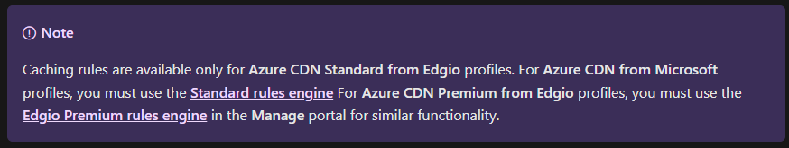

# Caching for solutions

## Azure Cache for Redis

After completing this module, you'll be able to:

- Explain the key scenarios Azure Cache for Redis covers and its service tiers
- Identify the key parameters for creating an Azure Cache for Redis instance and interact with the cache
- Connect an app to Azure Cache for Redis by using .NET

### Key scenarios

Azure Cache for Redis improves application performance by supporting common application architecture patterns. Some of the most common include the following patterns:

| Pattern                  | Description                                                                                                                                                                                                                                                                                                                                                                                                                                                                                                                 |
| ------------------------ | --------------------------------------------------------------------------------------------------------------------------------------------------------------------------------------------------------------------------------------------------------------------------------------------------------------------------------------------------------------------------------------------------------------------------------------------------------------------------------------------------------------------------- |
| Data cache               | Databases are often too large to load directly into a cache. It's common to use the [cache-aside](https://learn.microsoft.com/en-us/azure/architecture/patterns/cache-aside) pattern to load data into the cache only as needed. When the system makes changes to the data, the system can also update the cache, which is then distributed to other clients.                                                                                                                                                               |
| Content cache            | Many web pages are generated from templates that use static content such as headers, footers, banners. These static items shouldn't change often. Using an in-memory cache provides quick access to static content compared to backend datastores.                                                                                                                                                                                                                                                                          |
| Session store            | This pattern is commonly used with shopping carts and other user history data that a web application might associate with user cookies. Storing too much in a cookie can have a negative effect on performance as the cookie size grows and is passed and validated with every request. A typical solution uses the cookie as a key to query the data in a database. Using an in-memory cache, like Azure Cache for Redis, to associate information with a user is faster than interacting with a full relational database. |
| Job and message queuing  | Applications often add tasks to a queue when the operations associated with the request take time to execute. Longer running operations are queued to be processed in sequence, often by another server. This method of deferring work is called task queuing.                                                                                                                                                                                                                                                              |
| Distributed transactions | Applications sometimes require a series of commands against a backend data-store to execute as a single atomic operation. All commands must succeed, or all must be rolled back to the initial state. Azure Cache for Redis supports executing a batch of commands as a single [transaction](https://redis.io/topics/transactions).                                                                                                                                                                                         |

### Service tiers

Azure Cache for Redis is available in these tiers:

| Tier             | Description                                                                                                                                                                                                                       |
| ---------------- | --------------------------------------------------------------------------------------------------------------------------------------------------------------------------------------------------------------------------------- |
| Basic            | An OSS Redis cache running on a single virtual machine (VM). This tier has no service-level agreement (SLA) and is ideal for development/test and noncritical workloads.                                                          |
| Standard         | An OSS Redis cache running on two VMs in a replicated configuration.                                                                                                                                                              |
| Premium          | High-performance OSS Redis caches. This tier offers higher throughput, lower latency, better availability, and more features. Premium caches are deployed on more powerful VMs compared to the VMs for Basic or Standard caches.  |
| Enterprise       | High-performance caches powered by Redis Labs' Redis Enterprise software. This tier supports Redis modules including RediSearch, RedisBloom, and RedisTimeSeries. Also, it offers even higher availability than the Premium tier. |
| Enterprise Flash | Cost-effective large caches powered by Redis Labs' Redis Enterprise software. This tier extends Redis data storage to nonvolatile memory, which is cheaper than DRAM, on a VM. It reduces the overall per-GB memory cost.         |

The [Azure Cache for Redis Pricing](https://azure.microsoft.com/pricing/details/cache/) provides a detailed comparison of each tier.

### Configure Azure Cache for Redis

Go [here](https://learn.microsoft.com/en-gb/training/modules/develop-for-azure-cache-for-redis/3-configure-azure-cache-redis)

### Interact with Azure Cache for Redis by using .NET

Go [here](https://learn.microsoft.com/en-gb/training/modules/develop-for-azure-cache-for-redis/4-interact-redis-api) and [here](https://learn.microsoft.com/en-gb/training/modules/develop-for-azure-cache-for-redis/5-console-app-azure-cache-redis)

## Develop for storage on CDNs

A content delivery network (CDN) is a distributed network of servers that can efficiently deliver web content to users. A CDN stores cached content on edge servers in point-of-presence (POP) locations that are close to end users, to minimize latency.

After completing this module, you'll be able to:

- Explain how the Azure Content Delivery Network works and how it can improve the user experience.
- Control caching behavior and purge content.
- Perform actions on Azure CDN by using the Azure CDN Library for .NET.

### Azure Content Delivery Networks

Azure Content Delivery Network (CDN) offers developers a global solution for rapidly delivering high-bandwidth content to users. It caches content at strategically placed physical nodes across the world. Azure CDN can also accelerate dynamic content, which can't be cached, by using various network optimizations using CDN POPs. For example, route optimization to bypass Border Gateway Protocol (BGP).

The benefits of using Azure CDN to deliver web site assets include:

- Better performance and improved user experience for end users, especially when using applications in which multiple round-trips are required to load content.
- Large scaling to better handle instantaneous high loads, such as the start of a product launch event.
- Distribution of user requests and serving of content directly from edge servers so that less traffic is sent to the origin server.

#### How Azure Content Delivery Network works


1. A user (Alice) requests a file (also called an asset) by using a URL with a special domain name, such as `<endpoint name>.azureedge.net`. This name can be an endpoint hostname or a custom domain. The DNS routes the request to the best performing POP location, which is usually the POP that is geographically closest to the user.
2. If no edge servers in the POP have the file in their cache, the POP requests the file from the origin server. The origin server can be an Azure Web App, Azure Cloud Service, Azure Storage account, or any publicly accessible web server.
3. The origin server returns the file to an edge server in the POP.
4. An edge server in the POP caches the file and returns the file to the original requestor (Alice). The file remains cached on the edge server in the POP until the time-to-live (TTL) specified by its HTTP headers expires. If the origin server didn't specify a TTL, the default TTL is seven days.
5. Other users can then request the same file by using the same URL that Alice used, and can also be directed to the same POP.
6. If the TTL for the file hasn't expired, the POP edge server returns the file directly from the cache. This process results in a faster, more responsive user experience.

#### Requirements

- To use Azure Content Delivery Network, you must own at least one Azure subscription.
- You also need to create a content delivery network profile, which is a collection of content delivery network endpoints. Every content delivery network endpoint is a specific configuration which users can customize with required content delivery behaviour and access. To organize your content delivery network endpoints by internet domain, web application, or some other criteria, you can use multiple profiles.
- Since [Azure Content Delivery Network pricing](https://azure.microsoft.com/pricing/details/cdn/) gets applied at the content delivery network profile level. If you want to use a mix of pricing tiers you must create multiple content delivery network profiles.

##### Limitations

Each Azure subscription has default limits for the following resources:

- The number of CDN profiles that can be created.
- The number of endpoints that can be created in a CDN profile.
- The number of custom domains that can be mapped to an endpoint.

For more information about CDN subscription limits, visit [CDN limits](https://learn.microsoft.com/en-us/azure/azure-resource-manager/management/azure-subscription-service-limits).

#### Azure CDN features

Azure CDN offers the following key features:

- Dynamic site acceleration
- CDN caching rules
- HTTPS custom domain support
- Azure diagnostics logs
- File compression
- Geo-filtering

For a complete list of features that each Azure CDN product supports, visit [Compare Azure CDN product features](https://learn.microsoft.com/en-us/azure/cdn/cdn-features).

### Controlling caching behavior

You can use content delivery network caching rules to set or modify default cache expiration behavior. These caching rules can either be global or with custom conditions. Azure Content Delivery Network offers two ways to control how your files get cached:

- **Caching rules:** Azure Content Delivery Network provides global and custom types of caching rules.
    - Global caching rules - You can set one global caching rule for each endpoint in your profile, which affects all requests to the endpoint. The global caching rule overrides any HTTP cache-directive headers, if set.
    - Custom caching rules - You can set one or more custom caching rules for each endpoint in your profile. Custom caching rules match specific paths and file extensions, get processed in order, and override the global caching rule, if set.
- **Query string caching:** You can adjust how the Azure content delivery network treats caching for requests with query strings. If the file isn't cacheable, the query string caching setting has no effect, based on caching rules and content delivery network default behaviors.



#### Standard rules engine

In the Standard rules engine for Azure Content Delivery Network, a rule consists of one or more match conditions and an action. The rules engine is designed to be the final authority on how specific types of requests get processed by Standard Azure Content Delivery Network.

Common uses for the rules:

- Override or define a custom cache policy.
- Redirect requests.
- Modify HTTP request and response headers.

A rule consists of one or more match conditions and an action. The first part of a rule is a match condition or set of match conditions. In the Standard rules engine for Azure Content Delivery Network, each rule can have up to four match conditions. A match condition identifies specific types of requests for which defined actions are performed. If you use multiple match conditions, the match conditions are grouped together by using `AND` logic. Following is a table highlighting a few of the available match options.

| Match condition | Description                                                                                                                           |
| --------------- | ------------------------------------------------------------------------------------------------------------------------------------- |
| Device type     | Identifies requests made from a mobile device or desktop device.                                                                      |
| HTTP version    | Identifies requests based on the HTTP version of the request.                                                                         |
| Request cookies | Identifies requests based on cookie information in the incoming request.                                                              |
| Post argument   | Identifies requests based on arguments defined for the POST request method that's used in the request.                                |
| Query string    | Identifies requests that contain a specific query string parameter. This parameter is set to a value that matches a specific pattern. |

For a complete list of match conditions, visit [Match conditions in the Standard rules engine for Azure Content Delivery Network](https://learn.microsoft.com/en-us/azure/cdn/cdn-standard-rules-engine-match-conditions)

#### Caching and time to live

Files from publicly accessible origin web servers can be cached in Azure Content Delivery Network until their time to live (TTL) elapses. The TTL gets determined by the `Cache-Control` header in the HTTP response from the origin server. This article describes how to set `Cache-Control` headers for the Web Apps feature of Microsoft Azure App Service, Azure Cloud Services, ASP.NET applications, and Internet Information Services (IIS) sites, all of which are configured similarly. You can set the `Cache-Control` header either by using configuration files or programmatically.

If you don't set a TTL on a file, Azure CDN sets a default value. However, this default might be overridden if you set up caching rules in Azure. Default TTL values are as follows:

- Generalized web delivery optimizations: seven days
- Large file optimizations: one day
- Media streaming optimizations: one year

#### Content updating

Azure Content Delivery Network edge nodes cache contents until the content's time to live (TTL) expires. After the TTL expires, when a client makes a request for the content from the edge node, the edge node will retrieve a new updated copy of the content to serve to the client. Then the refreshed content in cache of the edge node.

The best practice to make sure your users always obtain the latest copy of your assets is to version your assets for each update and publish them as new URLs. Content delivery network will immediately retrieve the new assets for the next client requests. Sometimes you might wish to purge cached content from all edge nodes and force them all to retrieve new updated assets. The reason might be due to updates to your web application, or to quickly update assets that contain incorrect information.

You can purge content in several ways.

- On an endpoint by endpoint basis, or all endpoints simultaneously should you want to update everything on your CDN at once.
- Specify a file, by including the path to that file or all assets on the selected endpoint by checking the **Purge All** checkbox in the Azure portal.
- Based on wildcards (*) or using the root (/).

The Azure CLI provides a special purge verb that unpublishes cached assets from an endpoint. This is useful if you have an application scenario where a large amount of data is invalidated and should be updated in the cache. To unpublish assets, you must specify either a file path, a wildcard directory, or both:


```Bash
az cdn endpoint purge \
    --content-paths '/css/*' '/js/app.js' \
    --name ContosoEndpoint \
    --profile-name DemoProfile \
    --resource-group ExampleGroup
```

You can also preload assets into an endpoint. This is useful for scenarios where your application creates a large number of assets, and you want to improve the user experience by prepopulating the cache before any actual requests occur:

```Bash
az cdn endpoint load \
    --content-paths '/img/*' '/js/module.js' \
    --name ContosoEndpoint \
    --profile-name DemoProfile \
    --resource-group ExampleGroup
```

#### Geo-filtering

Geo-filtering enables you to allow or block content in specific countries/regions, based on the country/region code. In the Azure CDN Standard for Microsoft Tier, you can only allow or block the entire site.

### Interact with Azure Content Delivery Networks by using .NET

Go [here](https://learn.microsoft.com/en-gb/training/modules/develop-for-storage-cdns/4-azure-cdn-libraries-dotnet)
