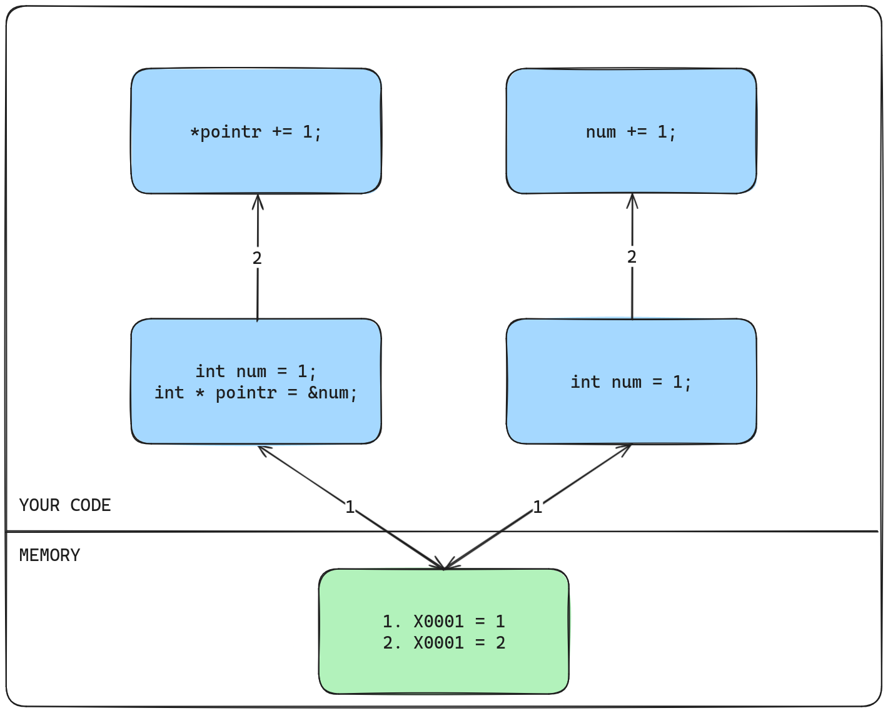

[Issue](https://github.com/Evanlab02/Learning-C/issues/14)

# Pointers

Pointers are also variables and play a very important role in C programming language. They are used for several reasons, such as:

- Strings
- Dynamic memory allocation
- Sending function arguments by reference
- Building complicated data structures
- Pointing to functions
- Building special data structures (i.e. Tree, Tries, etc...)

And many more.

### What is a pointer?

A pointer is essentially a simple integer variable which holds a **memory address** that points to a value, instead of holding the actual value itself.

The computer's memory is a sequential store of data, and a pointer points to a specific part of the memory. Our program can use pointers in such a way that the pointers point to a large amount of memory - depending on how much we decide to read from that point on.

### Strings as pointers

We've already discussed strings, but now we can dive in a bit deeper and understand what strings in C really are (which are called C-Strings to differentiate them from other strings when mixed with C++)

The following line:

```c
char * name = "John";
```

does three things:

1. It allocates a local (stack) variable called `name`, which is a pointer to a single character.
2. It causes the string "John" to appear somewhere in the program memory (after it is compiled and executed, of course).
3. It initialises the `name` argument to point to where the `J` character resides at (which is followed by the rest of the string in the memory).

If we try to access the `name` variable as an array, it will work, and will return the ordinal value of the character `J`, since the `name` variable actually points exactly to the beginning of the string.

Since we know that the memory is sequential, we can assume that if we move ahead in the memory to the next character, we'll receive the next letter in the string, until we reach the end of the string, marked with a null terminator (the character with the ordinal value of 0, noted as `\0`).

### Dereferencing

Dereferencing is the act of referring to where the pointer points, instead of the memory address. We are already using dereferencing in arrays - but we just didn't know it yet. The brackets operator - `[0]` for example, accesses the first item of the array. And since arrays are actually pointers, accessing the first item in the array is the same as dereferencing a pointer. Dereferencing a pointer is done using the asterisk operator `*`.

If we want to create an array that will point to a different variable in our stack, we can write the following code:

```c
/* define a local variable a */
int a = 1;

/* define a pointer variable, and point it to a using the & operator */
int * pointer_to_a = &a;

printf("The value a is %d\n", a);
printf("The value of a is also %d\n", *pointer_to_a);
```

Notice that we used the `&` operator to point at the variable `a`, which we have just created.

We then referred to it using the dereferencing operator. We can also change the contents of the dereferenced variable:

```c
int a = 1;
int * pointer_to_a = &a;

/* let's change the variable a */
a += 1;

/* we just changed the variable again! */
*pointer_to_a += 1;

/* will print out 3 */
printf("The value of a is now %d\n", a);
```

## Exercise

Create a pointer to the local variable `n` called `pointer_to_n`, and use it to increase the value of `n` by one.

### Provided code

```C
#include <stdio.h>

int main() {
  int n = 10;

  /* your code goes here */

  /* testing code */
  if (pointer_to_n != &n) return 1;
  if (*pointer_to_n != 11) return 1;

  printf("Done!\n");
  return 0;
}
```

### Solution code

```C
#include <stdio.h>

int main() {
  int n = 10;

  /* your code goes here */
  int * pointer_to_n = &n;
  *pointer_to_n += 1;

  /* testing code */
  if (pointer_to_n != &n) return 1;
  if (*pointer_to_n != 11) return 1;

  printf("Done!\n");
  return 0;
}
```

## Pointers - Can do the exact same job



## Pointers - Modify original or don't?

<iframe src="https://link.excalidraw.com/p/readonly/YfyWQDpIkZeO5sjfR0sp" width="100%" height="500px" style="border: none;"></iframe>

