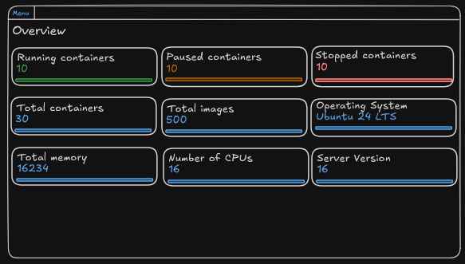

# Background

- [Branch](https://github.com/Evanlab02/DockerLens/tree/2-overview-page-wireframes)
- [Issue](https://github.com/Evanlab02/DockerLens/issues/2)
- [PR](https://github.com/Evanlab02/DockerLens/pull/16)
## Description

We should update the documentation with wire frames/mock-ups of the overview page. This page is what will greet users when they first open DockerLens.

### Acceptance Criteria

AC1 - Create wire frames for the overview page.

## Outcome

Pretty basic ticket, added wireframes for system overview page to the documentation.

